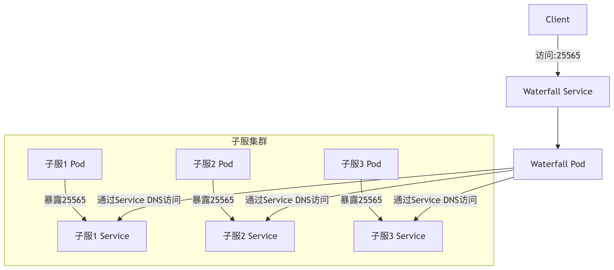

# 架构

# 镜像制作
## waterfall
`Dockerfile`:
```
FROM docker.1ms.run/eclipse-temurin:21-jre
WORKDIR /home/ubuntu

COPY config.yml /home/ubuntu/config.yml
COPY ../waterfall-1.21-598.jar /home/ubuntu/waterfall-1.21-598.jar

EXPOSE 25577

RUN echo end | java -Xms512M -Xmx1024M -Dfile.encoding=UTF-8 -jar waterfall-1.21-598.jar
CMD ["java", "-Xms512M", "-Xmx1024M", "-Dfile.encoding=UTF-8", "-jar", "waterfall-1.21-598.jar"]
```
参数修改：
`./config.yml`:
子服务器ip
持久化文件：
File:
`./config.yml`
`./waterfall.yml`
`./locations.yml`
Folder:
`./logs/`

## Lobby
`Dockerfile`:
```
FROM docker.1ms.run/eclipse-temurin:21-jre
WORKDIR /home/ubuntu

COPY DeluxeHubReloaded-3.7.2.jar /home/ubuntu/plugins/DeluxeHubReloaded-3.7.2.jar
COPY paper-1.21.8-28.jar /home/ubuntu/paper-1.21.8-28.jar
COPY eula.txt /home/ubuntu/eula.txt
COPY server.properties /home/ubuntu/server.properties
COPY spigot.yml /home/ubuntu/spigot.yml

EXPOSE 25565

RUN echo stop | java -Xmx4G -Xms4G -jar paper-1.21.8-28.jar
CMD ["java", "-Xmx4G", "-Xms4G", "-jar", "paper-1.21.8-28.jar"]

LABEL version="1.0" description="Lobby镜像初版 使用DeluxeHubReloaded-3.7.2"
```
参数修改：
**`server.properties`**：
`server-ip=waterfall  or  location`(不确定)
`enable-rcon=true`
`rcon.password=***`
**`eula.txt`**:
`eula=true`
**`spigot.yml`**:
`settings:bungeecord: true`
持久化文件：
File:
`./eula.txt`
`./server.properties`
`./spigot.yml`
`./ops.json`
`./usercache.json`
Folder:
`./logs/`
`./crash-reports/`
`./world/`
`./world_nether/`
`./world_the_end`
## Bingo
`Dockerfile`:
```
FROM docker.1ms.run/eclipse-temurin:21-jre
WORKDIR /home/ubuntu

COPY BingoReloaded-3.2.0.jar /home/ubuntu/plugins/BingoReloaded-3.2.0.jar
COPY packetevents-spigot-2.9.4.jar /home/ubuntu/plugins/packetevents-spigot-2.9.4.jar
COPY paper-1.21.8-28.jar /home/ubuntu/paper-1.21.8-28.jar
COPY eula.txt /home/ubuntu/eula.txt
COPY server.properties /home/ubuntu/server.properties
COPY spigot.yml /home/ubuntu/spigot.yml

EXPOSE 25565

RUN echo stop | java -Xmx4G -Xms4G -jar paper-1.21.8-28.jar
CMD ["java", "-Xmx4G", "-Xms4G", "-jar", "paper-1.21.8-28.jar"]
LABEL version="1.0" description="BingoReloaded-3.2.0镜像初版"
```

参数修改：
**`server.properties`**：
`server-ip=waterfall  or  location`(不确定)
`enable-rcon=true`
`rcon.password=***`
**`eula.txt`**:
`eula=true`
**`spigot.yml`**:
`settings:bungeecord: true`

持久化文件：
File:
`./eula.txt`
`./server.properties`
`./spigot.yml`
`./ops.json`
`./usercache.json`
Folder:
`./logs/`
`./crash-reports/`
`./world/`
`./world_nether/`
`./world_the_end`

## Blockracing

如上，略。

## 问题
1. 在终端输入指令时，输到一半会插入一些信息。如要输入server时，最终输入成`/sershtechcraft-game-bingo-7b847f46f4-rlcpr       0/1     OOMKilled   0             22sshtechcraft-game-lobby-675987ccdb-lltr6       0/1     OOMKilled   1 (12s ago)   22sver`，中间被插入了k8s的信息。
2. 需要合理指定给pod分配的内存。太大会导致milkyway的内存不足，太小会导致子服务器终止。
